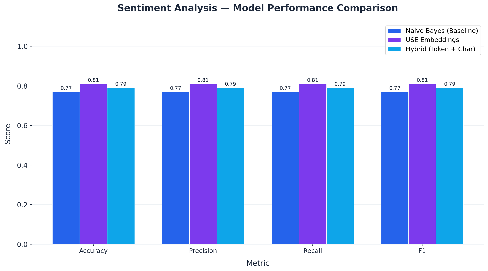

# Sentiment Analysis on 1.6M Tweets

> Comparing Classical ML and Deep Learning approaches for binary sentiment classification.



## Overview

This project builds and compares three NLP models for binary sentiment classification on the [Sentiment140](https://www.kaggle.com/datasets/kazanova/sentiment140) dataset — 1.6 million tweets labeled as positive or negative. The goal is to evaluate the tradeoff between model complexity and classification performance.

## Problem

Automated sentiment detection from social media text is a core NLP task used in brand monitoring, customer feedback analysis, and social listening. This project explores how different modeling approaches — from classical ML to transfer learning — perform on real-world tweet data at scale.

## Approach

**Preprocessing pipeline** (7 steps):
Remove HTML tags → Remove URLs → Normalize @mentions → Remove punctuation → Lowercase → Expand chat abbreviations → Remove stopwords → Remove duplicate whitespace

**Models compared:**

| # | Model | Description |
|---|-------|-------------|
| 1 | **TF-IDF + Naive Bayes** | Classical ML baseline using TF-IDF features |
| 2 | **Universal Sentence Encoder** | Transfer learning with Google's pretrained USE |
| 3 | **Hybrid Token + Char** | Multi-input architecture combining USE embeddings with character-level BiLSTM |

## Results

| Metric | Naive Bayes | USE Embeddings | Hybrid (Token + Char) |
|--------|-------------|----------------|----------------------|
| Accuracy | ~77% | ~81% | ~79% |
| Precision | ~0.77 | ~0.81 | ~0.79 |
| Recall | ~0.77 | ~0.81 | ~0.79 |
| F1 | ~0.77 | ~0.81 | ~0.79 |

*Note: Run the notebook to get exact values for your training run.*

## Tech Stack

Python, scikit-learn, TensorFlow, TensorFlow Hub, NLTK, pandas, matplotlib

## Repo Structure

```
├── run_pipeline.py                     # One command to run everything
├── README.md
├── requirements.txt
├── .gitignore
├── notebooks/
│   └── sentiment_analysis.ipynb        # Full walkthrough: EDA → preprocessing → 3 models → comparison
├── src/
│   ├── preprocessing.py                # Reusable text preprocessing pipeline
│   ├── evaluate.py                     # Model evaluation utilities
│   ├── train_baseline.py               # Standalone script to train the Naive Bayes baseline
│   └── generate_visuals.py             # Generate portfolio-quality charts
├── images/                             # Saved visualizations
├── outputs/                            # Saved model artifacts & results JSON (not tracked in git)
└── data/
    └── README.md                       # Dataset source and download instructions
```

## How to Run

**1. Clone and install:**
```bash
git clone https://github.com/BohdanChuprynka/Sentiment-Analysis-Model.git
cd Sentiment-Analysis-Model
pip install -r requirements.txt
```

**2. Run the full pipeline** (data → preprocessing → all 3 models → visuals):
```bash
python run_pipeline.py
```

**3. Or run baseline only** (no TensorFlow needed):
```bash
python run_pipeline.py --baseline
```

**4. Explore interactively:**

Open `notebooks/sentiment_analysis.ipynb` to walk through the full analysis — EDA, preprocessing, all three models, and comparison.

## Key Takeaways

- A simple TF-IDF + Naive Bayes baseline achieves competitive accuracy (~77%) with minimal compute, making it a strong starting point.
- Transfer learning with the Universal Sentence Encoder improves performance by leveraging pretrained sentence-level representations.
- Multi-input architectures (token + character) offer flexibility but require careful tuning and longer training to outperform simpler approaches.

## Future Improvements

- Fine-tune a transformer model (BERT/DistilBERT) for stronger performance
- Extend to multi-class emotion detection
- Add model inference API for real-time predictions
- Experiment with data augmentation techniques
