# Sentiment Analysis on 1.6M Tweets

> Comparing Classical ML and Deep Learning approaches for binary sentiment classification.


## Overview

This project builds and compares **five NLP models** for binary sentiment classification on the [Sentiment140](https://www.kaggle.com/datasets/kazanova/sentiment140) dataset — 1.6 million tweets labeled as positive or negative. The focus is on how preprocessing strategy, model architecture, and fine-tuning affect performance on noisy, real-world social media text.

## Problem

Automated sentiment detection from social media text is a core NLP task used in brand monitoring, customer feedback analysis, and social listening. This project explores how different modeling approaches — from classical ML to transfer learning with domain adaptation — perform on real-world tweet data at scale.

## Approach

### Dual Preprocessing Strategy

A key design decision: **different preprocessing for different model families**.

- **Heavy (for traditional ML):** Remove HTML/URLs/mentions → strip punctuation → lowercase → expand chat abbreviations → remove stopwords. This maximizes signal for bag-of-words models.
- **Light (for deep learning):** Remove HTML/URLs only → normalize mentions to `@user`. Preserves casing, punctuation, and sentence structure that neural networks can leverage.

### Models

| # | Model | Type | Preprocessing | Description |
|---|-------|------|---------------|-------------|
| 1 | **Naive Bayes** | Classical ML | Heavy | TF-IDF (100K features) + MultinomialNB baseline |
| 2 | **Logistic Regression** | Classical ML | Heavy | TF-IDF bigrams (300K features) + SGD-optimized log regression |
| 3 | **USE (Frozen)** | Transfer Learning | Light | Google's Universal Sentence Encoder as fixed feature extractor + dense head |
| 4 | **USE (Fine-tuned)** | Transfer Learning | Light | Two-phase training: warm up head, then unfreeze encoder with low LR |
| 5 | **Hybrid (Token+Char)** | Multi-input DL | Light | USE token embeddings + BiLSTM character embeddings combined |

## Results

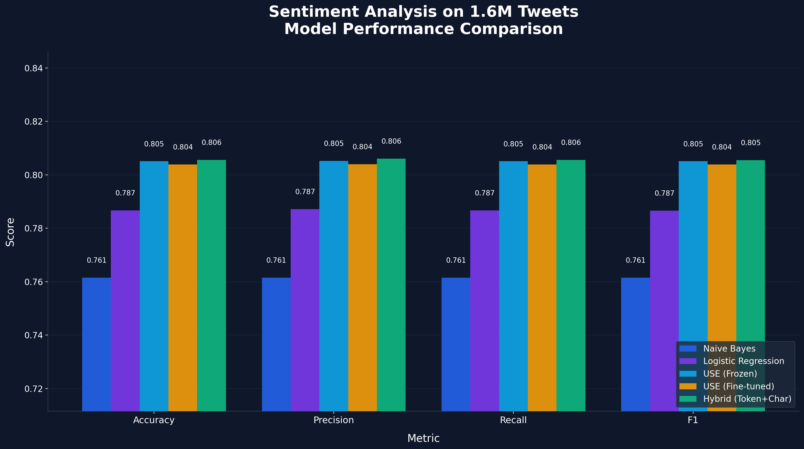

| Metric | Naive Bayes | Logistic Regression | USE (Frozen) | USE (Fine-tuned) | Hybrid (Token+Char) |
|--------|:-----------:|:-------------------:|:------------:|:----------------:|:-------------------:|
| Accuracy | 76.1% | 78.7% | 80.5% | 80.4% | **80.6%** |
| Precision | 0.761 | 0.787 | 0.805 | 0.804 | **0.806** |
| Recall | 0.761 | 0.787 | 0.805 | 0.804 | **0.806** |
| F1 | 0.761 | 0.787 | 0.805 | 0.804 | **0.805** |

### Confusion Matrices

| Naive Bayes | Logistic Regression | USE (Frozen) |
|:-----------:|:-------------------:|:------------:|
| 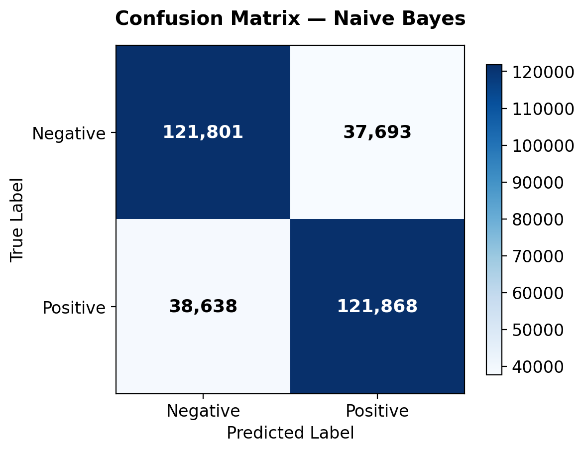 | 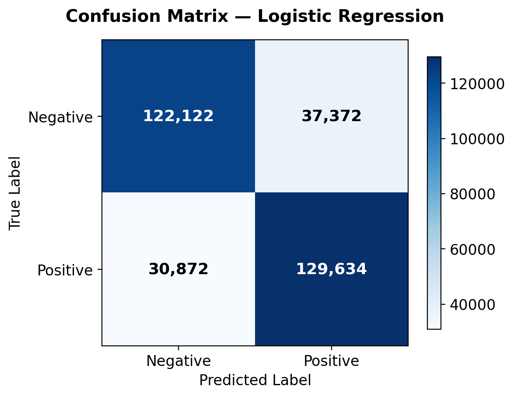 | 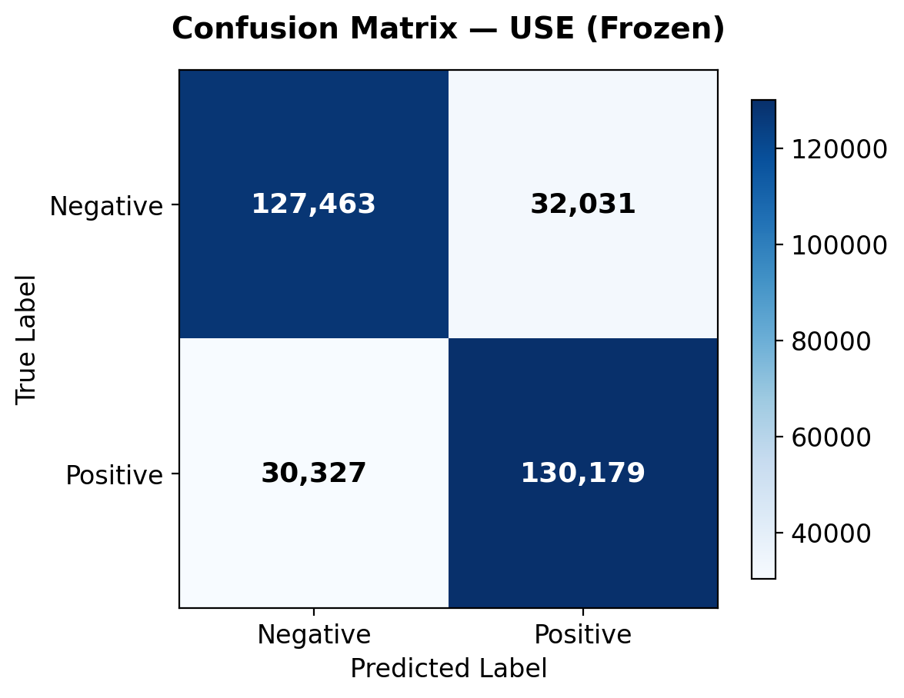 |

| USE (Fine-tuned) | Hybrid (Token+Char) |
|:----------------:|:-------------------:|
| 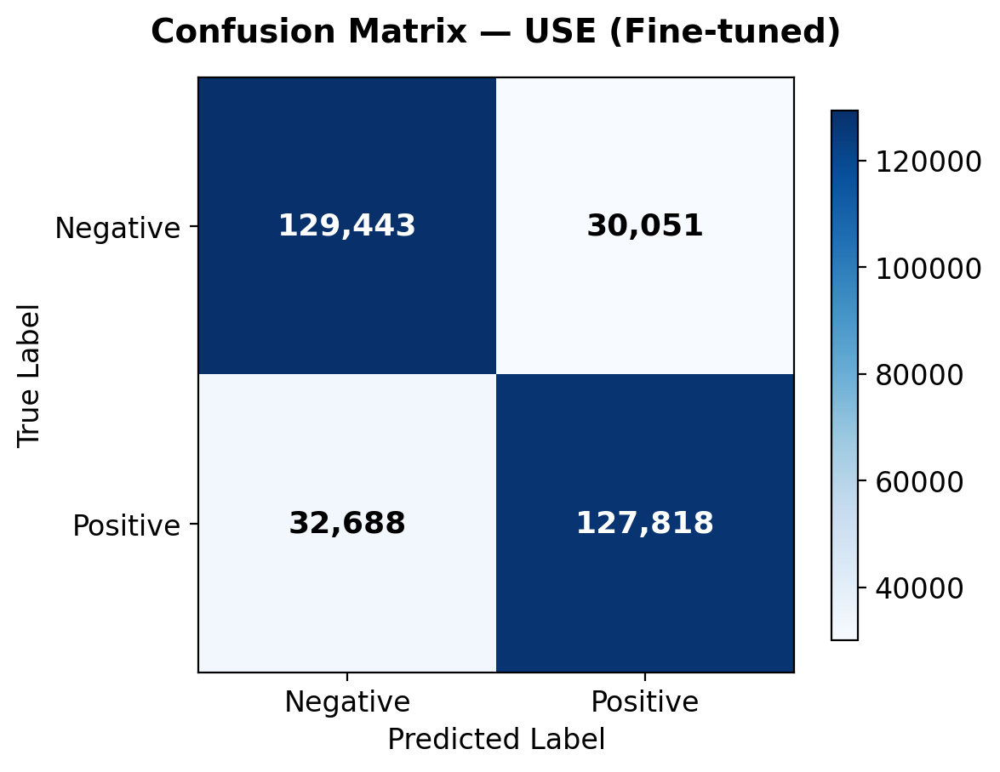 | 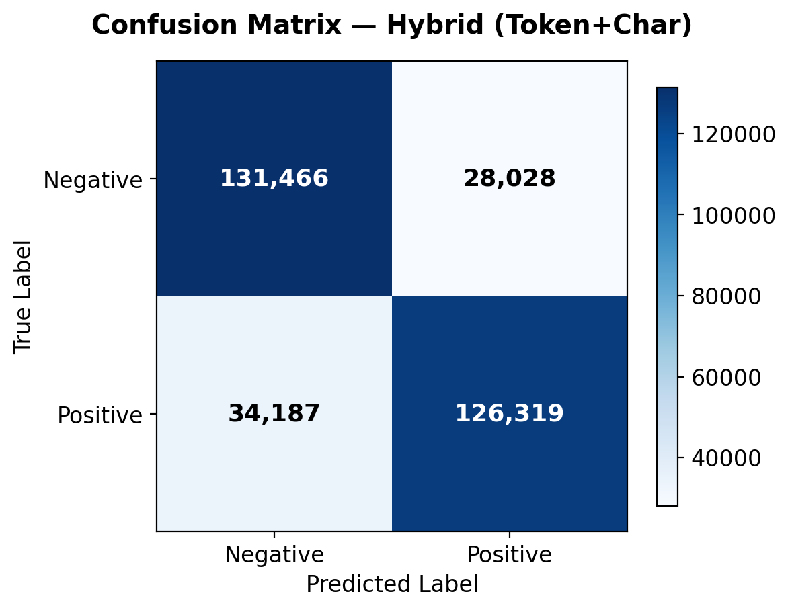 |

### Training Curves (DL Models)

| USE (Frozen) | USE (Fine-tuned) Phase 2 | Hybrid (Token+Char) |
|:------------:|:------------------------:|:-------------------:|
| 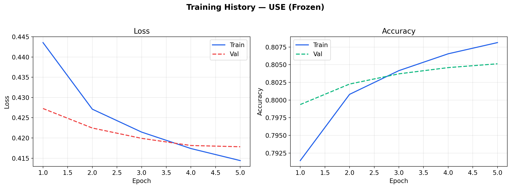 | 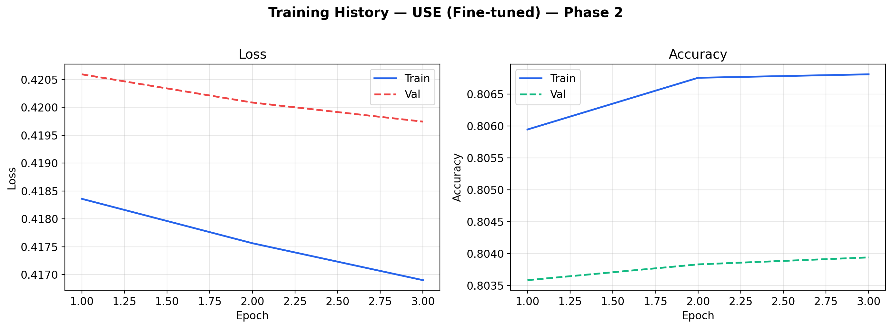 | 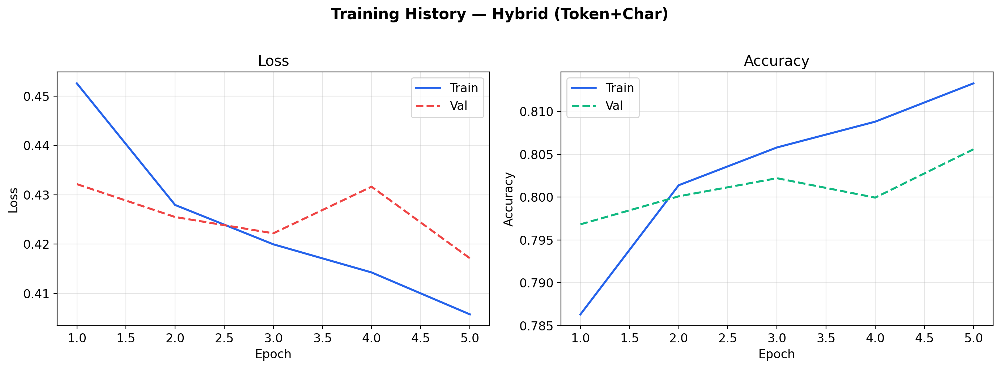 |

### EDA

| Class Distribution | Word Cloud |
|:------------------:|:----------:|
| 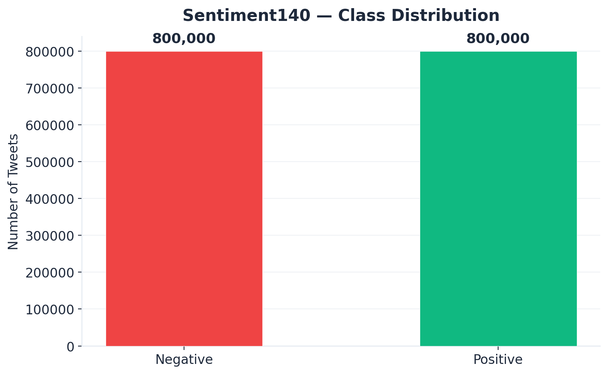 | 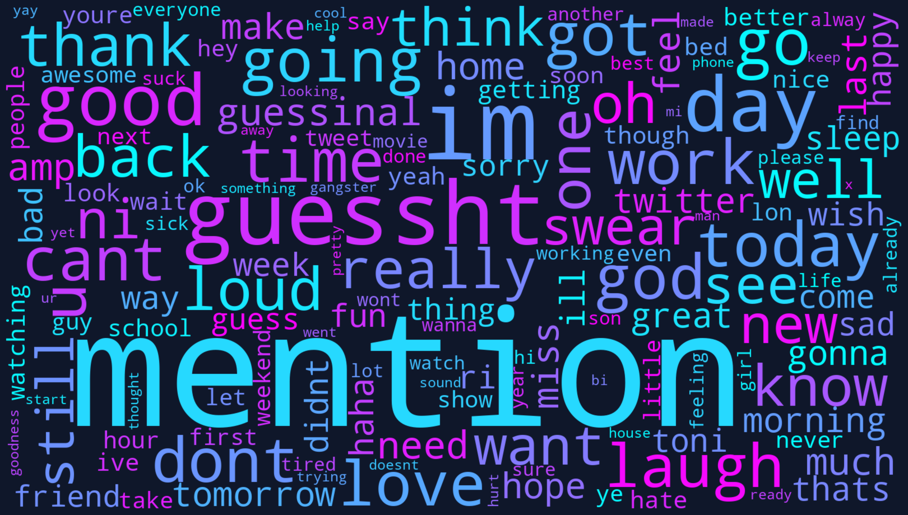 |

## Key Takeaways

1. **Preprocessing strategy matters more than architecture.** Switching from heavy to light preprocessing for neural models gave a bigger boost than adding model complexity. Neural networks benefit from casing, punctuation, and sentence structure that bag-of-words models can't use.

2. **Logistic Regression with bigrams is a strong baseline.** At 78.7% F1, it outperforms Naive Bayes by 2.6 percentage points — bigram features capture negation patterns ("not good") that unigram models miss.

3. **Transfer learning provides the biggest jump.** The USE frozen model reaches 80.5% — a 4.4pp improvement over Naive Bayes — by leveraging pretrained sentence-level representations.

4. **The Sentiment140 noise ceiling is real.** All models plateau in the 76–81% range because labels were assigned via distant supervision (emoticon heuristics). The ~4.5pp spread between models is meaningful, but bounded by label noise.

5. **Model checkpointing enables iterative experimentation.** All models save after training and skip to evaluation on rerun, making the notebook resilient to Colab timeouts.

## Tech Stack

Python, scikit-learn, TensorFlow, TensorFlow Hub, NLTK, pandas, matplotlib

## Repo Structure

```
├── run_pipeline.py                     # One command to run everything
├── README.md
├── requirements.txt
├── .gitignore
├── notebooks/
│   └── full_pipeline.ipynb             # Full walkthrough: EDA → dual preprocessing → 5 models → comparison
├── src/
│   ├── preprocessing.py                # Reusable text preprocessing pipeline
│   ├── evaluate.py                     # Model evaluation utilities
│   ├── train_baseline.py               # Standalone script to train the Naive Bayes baseline
│   └── generate_visuals.py             # Generate portfolio-quality charts
├── images/                             # Saved visualizations (confusion matrices, training curves, etc.)
├── outputs/                            # Saved model artifacts, checkpoints & results JSON
└── data/
    └── README.md                       # Dataset source and download instructions
```

## How to Run

**1. Clone and install:**
```bash
git clone https://github.com/BohdanChuprynka/Sentiment-Analysis-Model.git
cd Sentiment-Analysis-Model
pip install -r requirements.txt
```

**2. Run the full pipeline** (data → preprocessing → all 5 models → visuals):
```bash
python run_pipeline.py
```

**3. Or run baseline only** (no TensorFlow needed):
```bash
python run_pipeline.py --baseline
```

**4. Explore interactively:**

Open `notebooks/full_pipeline.ipynb` to walk through the full analysis — EDA, preprocessing, all five models, and comparison. Also runs on [Google Colab](https://colab.research.google.com/) with automatic environment detection.

## Future Improvements

- Fine-tune a transformer model (BERT/DistilBERT) for stronger performance
- Extend to multi-class emotion detection
- Add model inference API for real-time predictions
- Experiment with data augmentation techniques
